# Flujo de Django — Sistema de Autenticación y Autorización

## Arquitectura general del proyecto

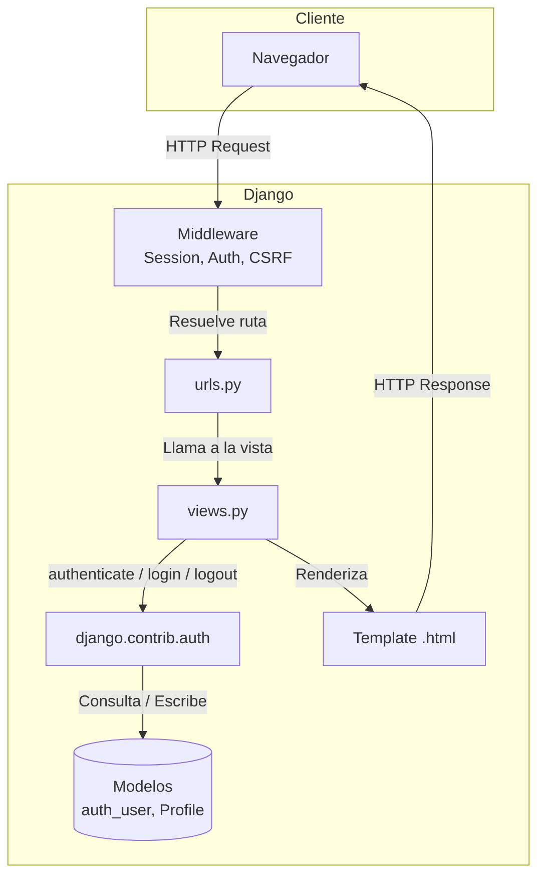

---

## 1. Flujo de Login (`/accounts/login/`)

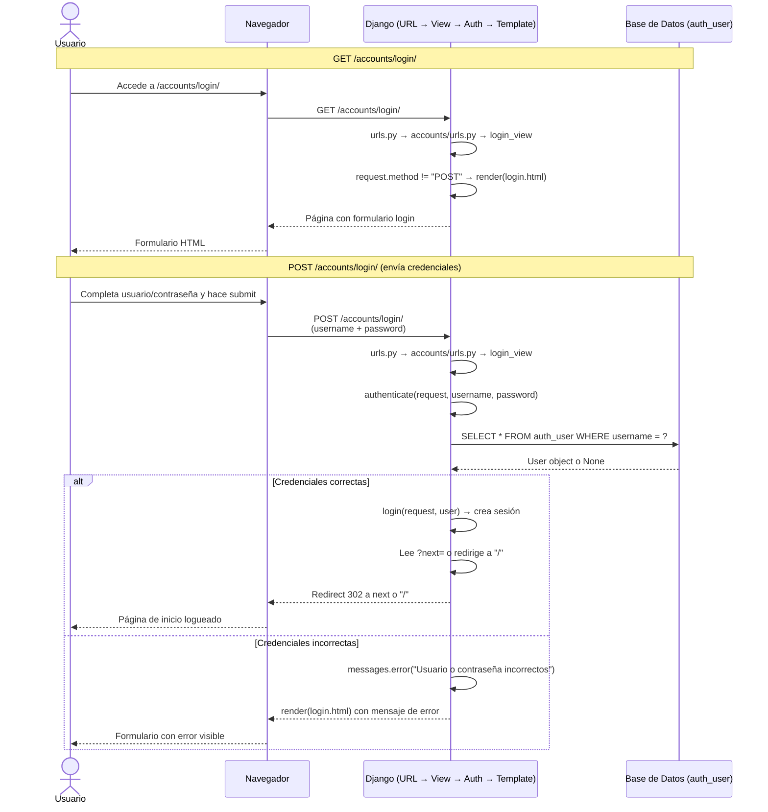

### Login — Ruta por archivos

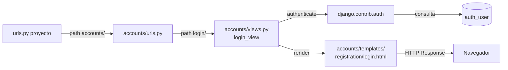

---

## 2. Flujo de Logout (`/accounts/logout/`)

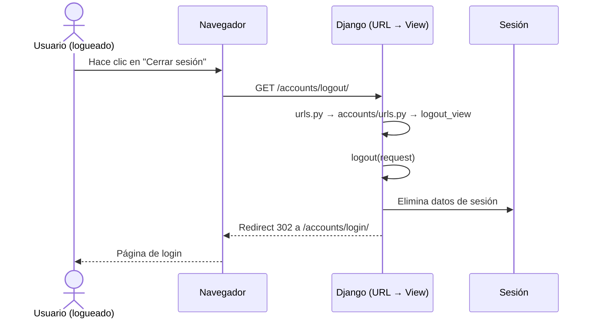

---

## 3. Flujo de Registro (`/accounts/signup/`)

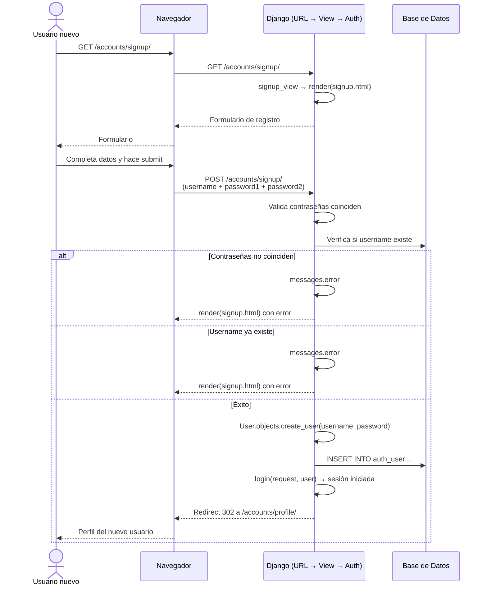

---

## 4. Flujo Perfil — CBV con `LoginRequiredMixin` (`/accounts/profile/`)

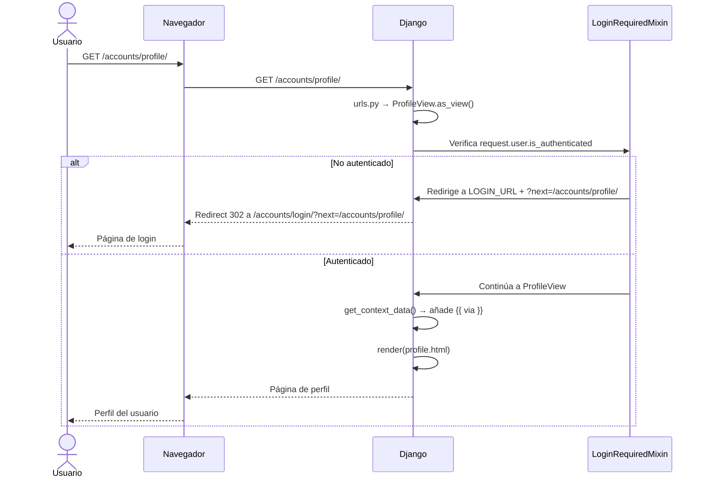

### LoginRequiredMixin — decisión interna

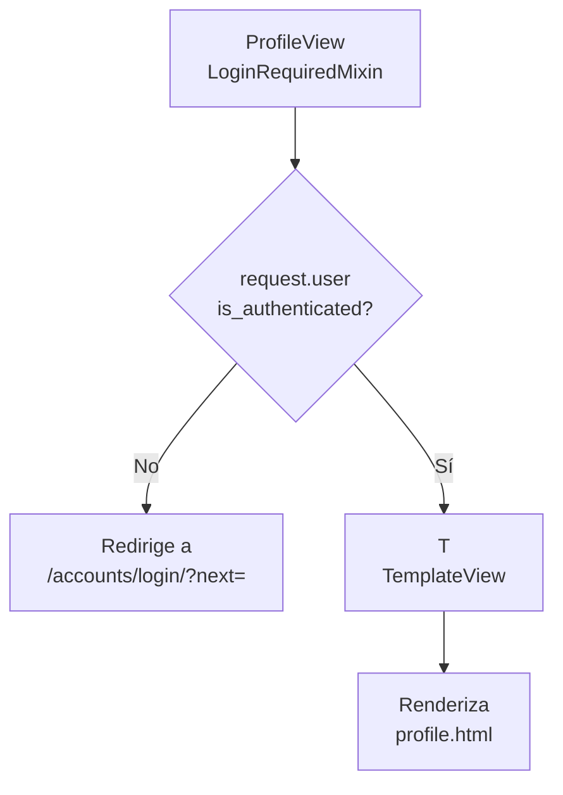

---

## 5. Flujo Dashboard — CBV con `LoginRequiredMixin` + `PermissionRequiredMixin` (`/accounts/dashboard/`)

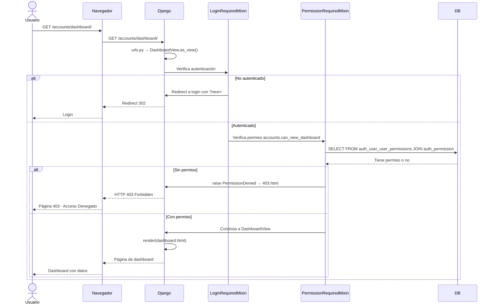

### PermissionRequiredMixin — decisión interna

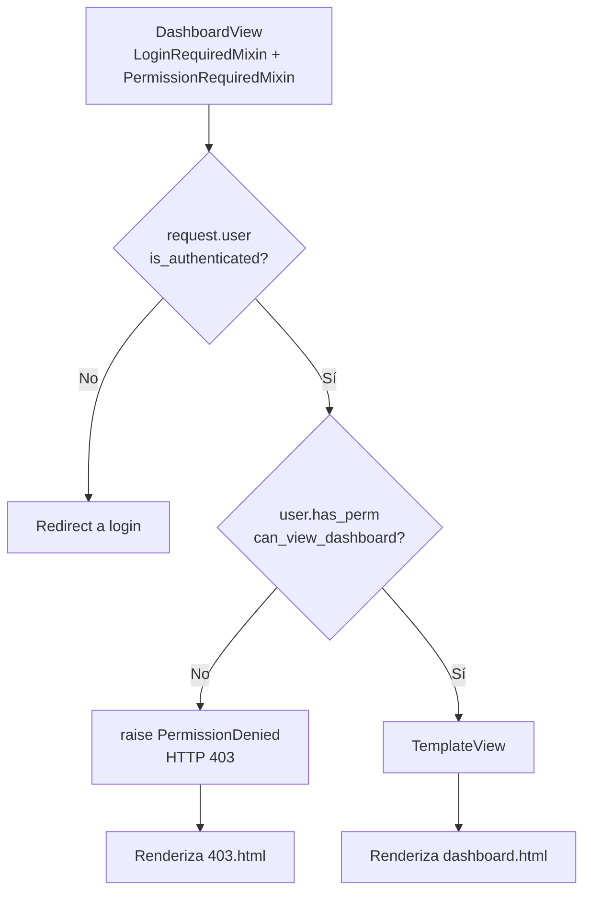

---

## 6. Flujo Perfil — FBV con `@login_required` (`/accounts/profile-fbv/`)

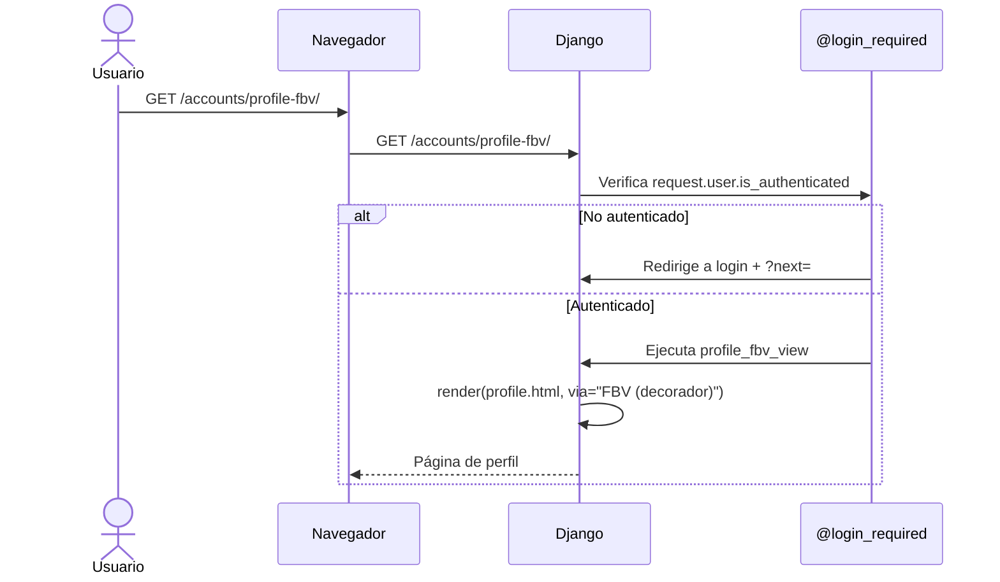

---

## 7. Flujo Dashboard — FBV con `@login_required` + `@permission_required` (`/accounts/dashboard-fbv/`)

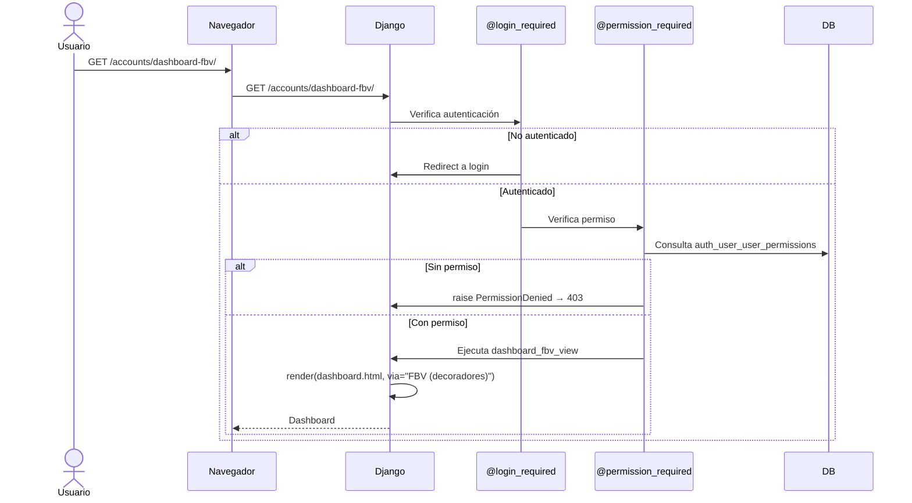

---

## 8. Mapa completo de rutas

```mermaid
graph TB
    subgraph Proyecto [seguridad_acceso_django/urls.py]
        R1[admin/] --> Admin
        R2[accounts/] --> AccountsURL
        R3["/ (vacío)"] --> HomeView
    end

    subgraph Accounts [accounts/urls.py]
        L1[login/] --> LoginView
        L2[logout/] --> LogoutView
        L3[signup/] --> SignupView
        L4[profile/] --> ProfileCBV
        L5[profile-fbv/] --> ProfileFBV
        L6[dashboard/] --> DashboardCBV
        L7[dashboard-fbv/] --> DashboardFBV
    end

    subgraph Views [accounts/views.py]
        LoginView[login_view] -->|POST| Auth[authenticate]
        LoginView -->|GET| TplLogin[login.html]
        LogoutView[logout_view] -->|Llama| Logout[logout]
        SignupView[signup_view] -->|POST| CreateUser[User.objects.create_user]
        CreateUser --> LoginAfter[login + redirect]
        ProfileCBV[ProfileView] -->|LoginRequiredMixin| TplProfile[profile.html]
        ProfileFBV[profile_fbv_view] -->|@login_required| TplProfile
        DashboardCBV[DashboardView] -->|LoginRequiredMixin + PermissionRequiredMixin| TplDash[dashboard.html]
        DashboardFBV[dashboard_fbv_view] -->|@login_required + @permission_required| TplDash
    end

    subgraph Templates [Templates]
        TplLogin
        TplProfile
        TplDash
        HomeView --> Home[home.html]
        Error403[403.html]
    end
```

---

## 9. Tabla de protección por ruta

| Ruta | Tipo | Protección | Qué pasa si no está autorizado |
|------|------|-----------|-------------------------------|
| `/` | Pública | — | — |
| `/accounts/signup/` | Pública | — | — |
| `/accounts/login/` | Pública | — | — |
| `/accounts/logout/` | Pública | — | — |
| `/accounts/profile/` | CBV | `LoginRequiredMixin` | Redirect a `/accounts/login/?next=/accounts/profile/` |
| `/accounts/profile-fbv/` | FBV | `@login_required` | Redirect a `/accounts/login/?next=/accounts/profile-fbv/` |
| `/accounts/dashboard/` | CBV | `LoginRequiredMixin` + `PermissionRequiredMixin` | No auth → redirect login. Sin permiso → HTTP 403 con `403.html` |
| `/accounts/dashboard-fbv/` | FBV | `@login_required` + `@permission_required` | No auth → redirect login. Sin permiso → HTTP 403 con `403.html` |
| `/admin/` | Django Admin | `is_staff` | Redirect a login admin |

---

## 10. Modelo de datos (Auth)

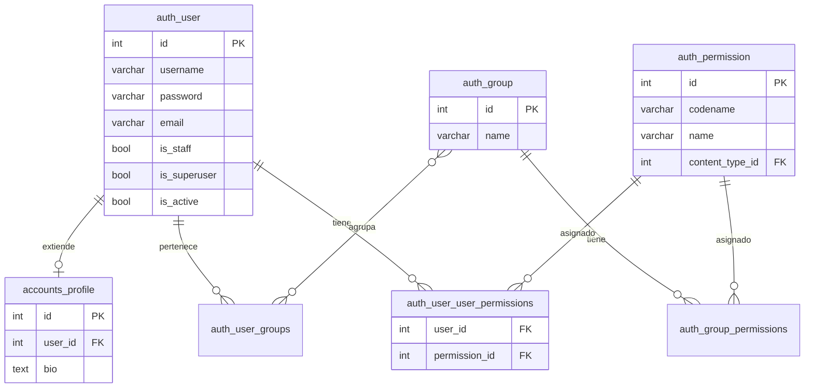

---

## 11. Ciclo completo de un request protegido (ej: Dashboard CBV)

```mermaid
flowchart LR
    REQ[Request del usuario] -->|HTTP| WSGI[WSGI / manage.py]
    WSGI --> MIDDLEWARE1[SecurityMiddleware]
    MIDDLEWARE1 --> MIDDLEWARE2[SessionMiddleware]
    MIDDLEWARE2 --> MIDDLEWARE3[CommonMiddleware]
    MIDDLEWARE3 --> MIDDLEWARE4[CsrfViewMiddleware]
    MIDDLEWARE4 --> MIDDLEWARE5[AuthMiddleware<br/>request.user disponible]
    MIDDLEWARE5 --> MIDDLEWARE6[MessageMiddleware]
    MIDDLEWARE6 --> URL_RESOLVER[URL resolver<br/>- seguridad_acceso_django/urls.py<br/>- accounts/urls.py]
    URL_RESOLVER --> VIEW[DashboardView<br/>accounts/views.py]

    VIEW --> CHECK_AUTH{LoginRequiredMixin<br/>user.is_authenticated?}
    CHECK_AUTH -->|No| REDIRECT[Redirect 302<br/>/accounts/login/?next=/dashboard/]
    REDIRECT --> RESPONSE[HTTP Response]

    CHECK_AUTH -->|Sí| CHECK_PERM{PermissionRequiredMixin<br/>user.has_perm?}
    CHECK_PERM -->|No| PERM_DENIED[PermissionDenied<br/>HTTP 403]
    PERM_DENIED --> RENDER_403[Render 403.html]
    RENDER_403 --> RESPONSE

    CHECK_PERM -->|Sí| GET[get_context_data]
    GET --> RENDER[Render dashboard.html]
    RENDER --> RESPONSE
    RESPONSE -->|HTTP Response| USER[Usuario ve la página]
```

---

## 12. Resumen de conceptos cubiertos

| Concepto | Dónde se implementa |
|---|---|
| Control de accesos | `LoginRequiredMixin` en `ProfileView` y `@login_required` en `profile_fbv_view` |
| Tablas modelo Auth | `auth_user`, `auth_permission`, `auth_user_user_permissions` usadas vía Django ORM |
| Autorización y permisos | `PermissionRequiredMixin` en `DashboardView` y `@permission_required` en `dashboard_fbv_view` |
| Redirección de accesos no autorizados | `LOGIN_URL` en `settings.py` + redirect con `?next=` + template `403.html` |
| `LoginRequiredMixin` | `accounts/views.py:49` — `class ProfileView(LoginRequiredMixin, TemplateView)` |
| `PermissionRequiredMixin` | `accounts/views.py:55` — `class DashboardView(LoginRequiredMixin, PermissionRequiredMixin, TemplateView)` |
| Login manual | `login_view` sin usar `LoginView` genérico de Django |
| Logout manual | `logout_view` sin usar `LogoutView` genérico de Django |
